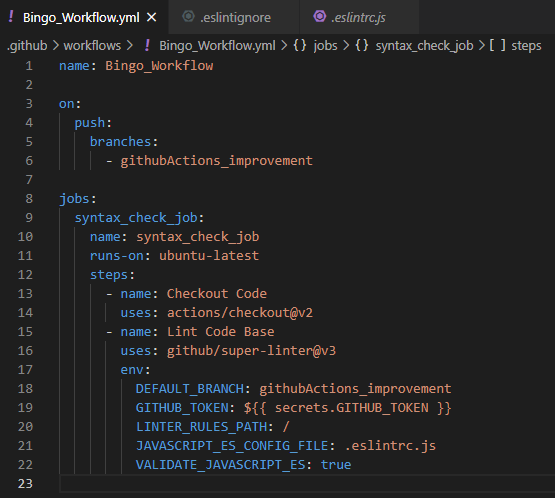

# Práctica Github Actions


## Qué es Github Actions?

**Github actions** es una nueva forma que nos ofrece Github de **automatizar la ejecución de código** en nuestro repositorio. Nos permiten automatizar tareas dentro del ciclo de vida del desarrollo de software. Pueden basarse en **JavaScript o Docker**, pero JavaScript suele presentar menos problemas. Las Actions son ejecutadas por **workflows**, y **pueden realziar cualquier tarea que deseemos**, por ejemplo, nos puede **ejecutar todos los tests** y avisarnos en caso que alguno, realizar **deploy** en servidores externos, etc. Una acción basada en JS, consta de un fichero .YML, un package.json y el codigo necesario de JavaScript.


Github dispone de su propia **MarketPlace** para publicar Actions realizadas por otros programadores: https://github.com/marketplace?type=actions
Para ejecutarla, necesitaremos un Workflow para indicar que se ejecute al realizar una determinada acción en nuestro repositorio, por ejemplo, un push.

## Qué es Github Workflows?

Un **workflow** o un **flujo de trabajo** en github, son ficheros que se ejecutan cuando realicemos la acción indicada en el mismo fichero, por ejemplo, **al realizar un push a una rama específica**. Estos ficheros constan de diferents **Jobs**, cada job puede **ejecutar distintos Actions**, ya sea propia o no, o simplemente, ejecutar un job con diferentes steps sin necesidad de llamar a un Action.


## Qué es NCC/Vercel?

**Vercel** es un **compilador para Node.JS**, el cual nos implementará en un mismo fichero todo el código junto a **todas las dependencias** del mismo, para poder desplegar-lo facilmente en diferentes plataformas. **Utilizamos Vercel para compilar nuestra Action** con el comando:
```
$ ncc build input.js -o dist
```

## Qué es Surge.sh?

**Surge** es una herramienta que nos permite **publicar nuestra aplicación web** estática en Internet de forma **GRATUITA** con un simple comando. 

```
$ surge
```

Nos pedirá un email y contraseña, y un nombre para el dominio, el cual será nombre.surge.sh, y en cuestión de segundos tendremos nuestra página web desplegada en internet **con un solo comando.**

## Qué es Nodemailer?

**Nodemailer** es un **libreria** para aplicaciones Node.JS que **permite enviar facilmente correos electronicos** mediante JavaScript. Utilizando esta libreria, hemos creado un Action para notificar a los usuarios por correo electronico que se ha realziado un commit en la rama indicada.

## Qué es Eslint?


**Eslint** es un linter, es decir, **un corrector de código**, que examina el codigo de JavaScript para determinar que **cumpla ciertos estándares y estilos**, favoreciendo de esta forma la escritura de **código de calidad**. Podemos configurarlo a nuestro gusto mediante un **fichero de configuración**, de esta manera, todo el equipo de trabajo puede mantener la misma estructura de código.

## En qué consiste el proyecto?

**Bingo Twingo** es un proyecto realizado en 2n DAW con **JavaScript Vanilla ES6**, gestionado por **webpack** con **hotreloading**, y **babel** para transcompilar el proyecto a versiones anteriores de JavaScript para una **mayor compatibilidad** con los demás navegadores. El proyecto consiste en la elaboración de un bingo con modo **Online y Offline**. Utilizamos **Websockets** para compartir información entre los distintos clientes y nuestro servidor que se encarga de elegir, aleatoriamente, el siguiente número y avisar a los clientes mediante **socketio**. Los clientes deberán marcar el numero  y avisar en caso de tener linea o bingo para que el servidor verifique que es correcto. El frontend o parte **cliente** es completamente **JavaScript puro ES6** y el **servidor** está elaborado con **NodeJS**.

## Qué es Jest?

**Jest** es un **framework de Javascript para testing** que destaca por su **simplicidad y amplias posibilidades**. Con Jest podemos crear facilmente **tests unitarios** para nuestro proyecto y ejecutarlos con un simple comando (**$ jest**). Está desarrollado por Facebook y puede utilizarse con diferentes frameworks de Javascript como React, Vue, Angular, Node, etc. Podemos **instalar jest** en nuestro proyecto con:

```
npm i --save jest
```

## Github Artifacts

Esta **API** nos permite **compartir información entre distintas tareas** de nuestro workflow. Desde una tarea, podemos subir un nuevo artifact, indicándole que información contendrá y como se llamará nuestro Artifact para poder descargarlo en otra tarea.

- **Upload Artifact:**

```
- name: artifact upload build
    uses: actions/upload-artifact@v2
    with:
      name: build_app
      path: ./dist
```

- **Download Artifact::**

```
- name: artifact download build
    uses: actions/download-artifact@v2
    with: 
      name: build_app
```


## Creación de Bingo_Workflow

A continuación, **crearemos un workflow** que se ejecutará cuando realicemos un **push en la rama "githubActions_improvement"** y constará de **seis jobs**. El primer job declararemos será para **verificar que la sintaxis** del proyecto es correcta.

### Job 1: Syntax_check_job

Para la realización de la **primera Job**, la cual se ejecutará en la **última versión de Ubuntu**, necesitaremos dos Steps, es decir, la tarea realizará dos pasos, el primero de ellos será **obtener el código de nuestra rama** de Github con **actions/checkout@v2**. Una vez ha obtenido el código, ejecutará otra Action que nos verificará que la sintaxis es correcta **github/super-linter@v3**. Pero debemos declarar varias **variables de entorno** para que pueda encontrar el **fichero de configuración de Eslint (.eslintrc.js)** en nuestro proyecto, donde indicaremos que tipo de verificación realizará eslint en nuestro proyecto.
- **DEFAULT_BRANCH**: githubActions_improvement
- **GITHUB_TOKEN**: ${{ secrets.GITHUB_TOKEN }}
- **LINTER_RULES_PATH**: /
- **JAVASCRIPT_ES_CONFIG_FILE**: .eslintrc.js
- **VALIDATE_JAVASCRIPT_ES**: true

Debemos tener en cuenta, que dentro del proyecto contamos con ficheros de documentación y varios tests, los cuales eslint no es capaz de detectar e ignorar por su propia cuenta, por lo que tenemos que crear un fichero especial para indicarle que ignore este tipo de ficheros (**.eslintignore**).

#### Bingo_Workflow.yml



#### .Eslintignore


#### .Eslintrc.js


#### Comprobar ejecución de Actions

Al realizar un push a la rama indicada (**githubActions_improvement**), se ejecutará el workflow que hemos creado. Seguidamente comprobamos que todo ha ido corréctamente:


### Job 2: Test_execution_job

Nuestra siguiente Job se encargará de **ejecutar los tests unitarios de nuestro proyecto**. Al igual que la anterior tarea y las siguientes, todas se ejecutarán en un **entorno de Ubuntu**, más concretamente, en la última versión disponible de Ubuntu. El primer paso que realizará nuestra Job será **obtener el código de nuestro repositorio**. A continuación, realizará un segundo Step, el cual instalará (en el entorno virtual de trabajo de Ubuntu-latest), todas las **dependencias** de nuestro proyecto y ejecutará el siguiente comando para **iniciar los tests** unitarios realizados con **Jest**:

```npm run test```

#### Tests que ejecutará nuestro Job


#### Bingo_Workflow.yml


#### Comprobar ejecución de Actions

Podemos observar que la job que hemos creado, junto a la anterior, se han ejecutado correctamente al realizar un push a la rama indicada.


### Job 3: Build_statics_job

Nuestra siguiente tarea se encargará de **crear los estáticos** o mejor dicho, **compilar nuestro proyecto** para próximamente desplegarlo via web. Este job solo **se ejectuará después de que hayan finalizado los dos jobs anteriores**. El primer paso, al igual que en las otras tareas, obtendremos el código de nuestro repositorio. A continuación, en el siguiente paso **instalaremos las dependencias** indicadas en nuestro **package.json** y ejecutaremos el comando necesario para compilar nuestro proyecto:

```npm run buildDev```

Finalmente, necesitamos un **tercer paso**. Este se encargará de **subir nuestro proyecto compilado** como un **Artifact** a un "nube" entre nuestras Jobs, para poder obtener estos estáticos en diferentes jobs, ya que debemos tener en cuenta que **cada tarea se ejecuta en un entorno virtual de Ubuntu independiente**, por lo que no están conectadas. Para ello, indicamos que se suba nuestra carpeta **dist** que ha sido generada al compilar nuestro proyecto.

#### Bingo_Workflow.yml


En nuestra Artifact Action, indicaremos que nombre tendra nuestro artifact y que directorio o fichero subiremos.


### Job 4: Deploy_job

Esta tarea se encargará de **obtener los estáticos generados en la anterior tarea** y despelgarlos en **surge.sh**. Por ende, dependerá de la tarea anterior, es decir, si la creación de los estáticos no se ha ejecutado correctamente, está tarea no se ejecutará. Para ello contaremos con **dos pasos**, el primero se encargará de **obtener el artifact** generado en el Job anterior:

```
  - name: artifact download build
    uses: actions/download-artifact@v2
    with: 
      name: build_app
```

El **segundo paso**, **desplegará nuestra aplicación en surge**. Para ello necesitamos el **Token** generado por Surge.sh y el correo asociado, además del dominio donde se desplegará y los archivos que subirá:

```
  - name: deploy app on surge
    uses: dswistowski/surge-sh-action@v1
    with:
      domain: jrevertvila.surge.sh
      project: .
      token: ${{secrets.SURGE_TOKEN }}
      login: ${{secrets.SURGE_LOGIN }}
```

Para **almacenar los datos sensibles** en un entorno seguro, recurrimos a los **Secrets** de Github. Para crealos, accedemos a los ajustes de nuestro repositorio, y en la sección secrets podremos crear los nuestros.


A continuación, realizamos un **push** para comprobar que se ejecute correctamente todo nuestro workflow:

#### Bingo_Workflow.yml


#### Comprobar ejecución de Actions


#### Comprobar surge.sh domain


#### Comprobar Upload Artifact


#### Comprobar Download Artifact


### Job 5: Notification_job

Nuestro siguiente job consiste en **enviar una notificación** a los usuarios del proyecto **via correo electrónico**. Para ello, crearemos nuestra **propia Action con JavaScript**. Esta tarea tiene la característica de que **se ejecutará siempre** aun si las demás jobs fallan, ya que indicará los resultados en el mensaje del correo.

Primero creamos una nueva dirección de correo (**opcional**), y, en la sección de privacidad y seguridad de nuestra cuenta, activamos la opción **Acceso de aplicaciones poco seguras**, ya que si no lo activamos, no podremos enviar correos mediante nuestro script.


A continuación, procedemos a crear nuestro script. Para ello utilizaremos **NodeJS**, por lo que ejecutaremos el siguiente comando para **crear nuestro entorno de trabajo**:

```npm init```

#### Index.js

Nuestro **index.js** tendrá en siguiente código:

```
var nodemailer = require('nodemailer');
const core = require("@actions/core");

var transporter = nodemailer.createTransport({
  service: 'gmail',
  auth: {
    user: 'jrevertvila.testing@gmail.com',
    pass: core.getInput('TESTING_EMAIL_PASSWORD')
  }
});

var mailOptions = {
  from: 'jrevertvila.testing@gmail.com',
  to: core.getInput('MY_EMAIL'),
  subject: 'Resultado del workflow ejecutado',
  text: `Se ha realizado un push en la rama githubActions_improvement que ha provocado la ejecución del workflow Bingo_Workflow con los siguientes resultados:\n\n- syntax_check_job: ${setMsg(core.getInput('JOB1'))}\n\n- test_execution_job: ${setMsg(core.getInput('JOB2'))}\n\n - build_statics_job: ${setMsg(core.getInput('JOB3'))}\n\n - deploy_job: ${setMsg(core.getInput('JOB4'))}`
};

transporter.sendMail(mailOptions, function(error, info){
  if (error) {
    core.setFailed(error);
  } else {
    core.setOutput("response", "Mensaje enviado");
  }
});

function setMsg(msg){
  if (msg == ''){
    return "Skipped"
  } else {
    return msg
  }
}
```

Utilizaremos una libreria llamada **Nodemailer** para enviar correos facilmente. Además de la libreria **@actions/core** para obtener los datos establecidos en el fichero **action.yml**. Además, he creado una función para establecer "**Skipped**" **en las Jobs que no hayan sido ejecutadas a causa de un fallo en una job anterior**, ya que Github no nos proporciona ninguna información en caso de que no se ejecute. Finalmente, necesitamos crear los estáticos, es decir, **compilar nuestra action**. Para ello utilizaremos **Vercel-NCC**. Lo instalaremos a nivel global para poder utilizarlo en cualquier momento:

```
npm i @vercel/ncc
```

Una vez instalado, nos situamos en el directorio de nuestra action y ejecutamos el siguiente comando:

```
ncc build index.js -o dist
```


#### Action.yml

Vamos a crear también un el fichero **action.yml**:

```
name: "Send mail with nodemailer"
description: "Action to send email"
inputs:
  TESTING_EMAIL_PASSWORD:
    description: "Password of testing email"
    required: true
  MY_EMAIL:
    description: "Email to send mail"
    required: true
  JOB1:
    description: "JOB 1"
    required: true
  JOB2:
    description: "JOB 2"
    required: true
  JOB3:
    description: "JOB 3"
    required: true
  JOB4:
    description: "JOB 4"
    required: true
outputs:
  response:
    description: "Action response"
runs:
  using: "node12"
  main: "dist/index.js"
```

Este fichero consta de **varios inputs** que necesitará nuestro script JS. Entre ellos estan los **resultados de todas las tareas**, además de nuestro **correo y contraseña**, los cuales estableceremos como **secrets de Github**. Finalmente indicaremos que se ejecutará en un entorno de trabajo de node, en la versión 12 y que utilizará los estaticos generados de nuestra action.

Nuestra Action ya está completa, pero ahora falta **ejecutarla desde nuestro workflow.yml** y pasarle los inputs necesarios.

#### Bingo_workflow.yml 

Para ello, añadiremos una nueva tarea, llamada **notification_job**. Esta Job se ejecutará una vez hayan finalizado todas las tareas anteriores, pero debemos indicarle **que se ejecute** **SIEMPRE**. para ello, escribiremos las siguientes lineas:

```
  needs: [syntax_check_job, test_execution_job, build_statics_job, deploy_job]
  if: ${{ always() }} #Se ejecutará siempre aunque los otros fallen
```

Contaremos con **dos pasos**. El primero se encargará de obtener el código de nuestro repositorio con **actions/checkout@v2**. El segundo ejecutará nuestra action. Debemos indicarle **6 parametros de entrada**, 4 de ellos son los resultados de las jobs anteriores, y los dos restantes son los credenciales de la cuenta de correo electrónico. Estos credenciales están almacenados en secrets:


Para **obtener los resultados de las jobs anteriores**, necesitamos **establecer un parámetro de salida** en cada una de ellas, por lo que escribiremos las siguientes lineas en las 4 jobs anteriores: 

```
outputs:
  output1: ${{ job.status }}
```

Estableceremos como parámetro de salida (**output1**), el estado de la tarea actual (**job.status**).

Ahora ya podemos acceder al resultado de las tareas desde nuestra quinta job con la siguiente linea:
(Ejemplo para Job1)
```
JOB1: ${{needs.syntax_check_job.outputs.output1}}
```

Finalmente, este sería nuestro **Workflow.yml**:


Procedemos a realizar un **commit a nuestra rama** y comprobamos que el email se haya enviado correctamente, incluso en caso que alguna de las jobs falle:

#### Comprobaciones


### Job 6: Update_readme_job

Esta será la **ultima job de nuestro workflow**. Se encargará de **acutalizar nuestro Readme** para indicar la **ultima fecha del despliegue** de nuestra aplicación en surge. Por ello, dependerá de que la tarea de deploy se haya realizado correctamente. Esta última job tendrá **3 pasos**:
- El primero de ellos **obtendrá el código de nuestro repositorio**.
- El segundo **modificará el readme**, para ello **eliminará la última linea del fichero**, de esta forma eliminaremos la fecha de despliegue anterior, y **añadirá otra linea** con la fecha del último despliegue a nuestro readme:

```
sed -i '$d' README.md
echo -e "\nUltima versión desplegada el día: `date`" >> README.md
```

El siguiente paso será **realizar un commit en nuestro repositorio** y la rama indicada con el readme actualizado. Para ello ejecutaremos un Step con los siguientes comandos:
```
      - name: Push changes
        run: |
          git config user.name Jooui
          git config user.email jrevertvila@gmail.com
          git add .
          git commit -m "Readme modificado"
          git push origin githubActions_improvement
```

Nuestra job quedaría así:


Finalmente, realizamos un push para añadir esta última tarea y comprobar si nuestro readme se ha actualizado:


Ya hemos creado completamente nuestro workflow con las actions indicadas. Ahora siempre que realicemos un push a la rama indicada en nuestro workflow, se ejecutaran todas las tareas y nos avisará del resultado por correo electrónico. **Así queda finalmente nuestro fichero Bingo_Workflow.yml:**

## Workflow Completo

```
name: Bingo_Workflow

on:
  push:
    branches:
      - githubActions_improvement

jobs:
  syntax_check_job:
    name: syntax_check_job
    runs-on: ubuntu-latest
    steps:
      - name: Checkout Code
        uses: actions/checkout@v2
      - name: Lint Code Base
        uses: github/super-linter@v3
        env:
          DEFAULT_BRANCH: githubActions_improvement
          GITHUB_TOKEN: ${{ secrets.GITHUB_TOKEN }}
          LINTER_RULES_PATH: /
          JAVASCRIPT_ES_CONFIG_FILE: .eslintrc.js
          VALIDATE_JAVASCRIPT_ES: true
    outputs:
      output1: ${{ job.status }}

  test_execution_job:
    name: test_execution_job
    runs-on: ubuntu-latest
    outputs:
      output1: ${{ job.status }}
    steps:
      - name: Checkout Code
        uses: actions/checkout@v2
      - name: Ejecutar tests con jest
        run: |
          npm i
          npm run test

  build_statics_job:
    name: build_statics_job
    runs-on: ubuntu-latest
    needs: [syntax_check_job, test_execution_job]
    outputs:
      output1: ${{ job.status }}
    steps:
      - name: Checkout Code
        uses: actions/checkout@v2
      - name: build app
        run: |
          npm i
          npm run buildDev
      - name: artifact upload build
        uses: actions/upload-artifact@v2
        with:
          name: build_app
          path: ./dist

  deploy_job:
    name: deploy_job
    runs-on: ubuntu-latest
    needs: build_statics_job
    outputs:
      output1: ${{ job.status }}
    steps:
    - name: artifact download build
      uses: actions/download-artifact@v2
      with: 
        name: build_app
    - name: deploy app on surge
      uses: dswistowski/surge-sh-action@v1
      with:
        domain: jrevertvila.surge.sh
        project: .
        token: ${{secrets.SURGE_TOKEN }}
        login: ${{secrets.SURGE_LOGIN }}

  notification_job:
    name: notification_job
    runs-on: ubuntu-latest
    needs: [syntax_check_job, test_execution_job, build_statics_job, deploy_job]
    if: ${{ always() }} #Se ejecutará siempre aunque los otros fallen
    steps:
      - name: Checkout code
        uses: actions/checkout@v2
      - name: Send mail to own email
        uses: ./.github/actions/email_notification
        with:
          TESTING_EMAIL_PASSWORD: ${{ secrets.TESTING_EMAIL_PASSWORD }}
          MY_EMAIL: ${{ secrets.MY_EMAIL }}
          JOB1: ${{needs.syntax_check_job.outputs.output1}}
          JOB2: ${{needs.test_execution_job.outputs.output1}}
          JOB3: ${{needs.build_statics_job.outputs.output1}}
          JOB4: ${{needs.deploy_job.outputs.output1}}
  
  update_readme_job:
    name: update_readme_job
    runs-on: ubuntu-latest
    needs: deploy_job
    steps:
      - name: Checkout code
        uses: actions/checkout@v2
      - name: update readme
        run: |
          sed -i '$d' README.md
          echo -e "\nUltima versión desplegada el día: `date`" >> README.md
      - name: Push changes
        run: |
          git config user.name Jooui
          git config user.email jrevertvila@gmail.com
          git add .
          git commit -m "Readme modificado"
          git push origin githubActions_improvement

```